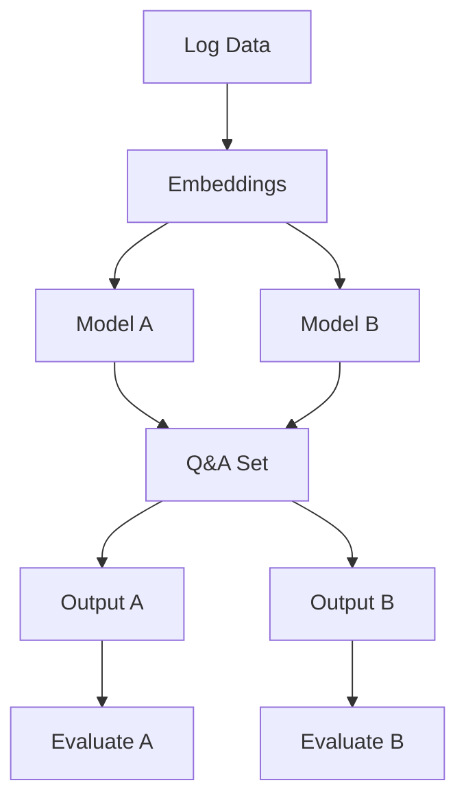

# BigLogsTinyBrains

Big Logs Tiny Brains: Q&amp;A on Security Logs with Small Language Models

## Introduction

## Literature Review

## Data Analysis

## Methodology 

Rough data flow diagram...

## Results

## Discussion

## References 
