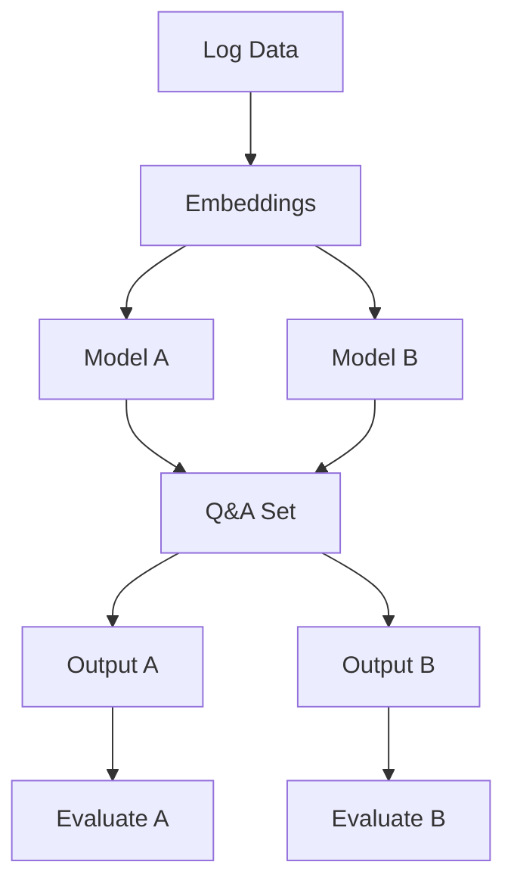

# SLLIM: System Log Local Intelligent Model

## Introduction

In today’s digital age, the widespread adoption of internet-connected devices—ranging from IoT devices to mobile phones—has created an unprecedented volume of data. Enterprises, relying on complex systems, face a growing challenge in monitoring, managing, and securing system-generated logs. In securing those environments, it is crucial to have a robust system log analysis tool that can quickly and accurately identify potential threats and anomalies. Traditional methods rely heavily on static pattern recognition techniques, which often fall short when faced with the dynamic nature of modern log data. To address this growing problem, we introduce a novel approach that leverages lightweight LLMs for real-time system log analysis via domain-specific question-answering with a specific focus on balancing performance and computational efficiency.

In our efforts to develop this approach, we established two research questions that guide this pursuit.

1. How well can lightweight LLMs detect system issues and security threats from system logs?
2. How effectively can lightweight LLMs perform question answering compared to larger, more resource-intensive models?

Here is your text updated with the Markdown citation format:

---

After a comprehensive literature review exploring these questions and adjacent research, we sought out a publicly available cybersecurity dataset that would sufficiently represent real-world traffic and cybersecurity threats. We selected the **Kitsune Network Attack Dataset**, which offers a rich collection of network traffic data captured from both an IP-based commercial surveillance system and an IoT network environment [(Mirsky et al., 2018)](#mirsky2018). The Kitsune dataset stands out for its diversity, containing nine distinct types of network attacks, including reconnaissance, man-in-the-middle (MitM), denial of service (DoS), and botnet attacks [(Mirsky et al., 2018)](#mirsky2018). With over 27 million instances and multiple features for each network packet, it provides a comprehensive view of both benign and malicious network activities [(Mirsky et al., 2018)](#mirsky2018). The dataset's structure allows for in-depth analysis of various attack vectors and their impact on network behavior, aiding in the construction of complex question-answer pairs. Moreover, the dataset’s inclusion of both raw network packet captures and preprocessed feature vectors enables us to develop and test intrusion detection as a Q&A task that can potentially be applied in real-world cybersecurity contexts.

## Literature Review

The increasing complexity and size of system logs in cybersecurity domains have made it challenging for human operators to derive insights quickly. Large language models (LLMs) offer a solution by automating the question-answering (QA) process, enabling rapid information retrieval and analysis. However, the constraints of edge environments, such as limited computational power, necessitate lightweight, efficient models that can be deployed locally. This review synthesizes recent research on deploying optimized LLMs in resource-constrained settings, particularly for real-time or offline QA tasks on cybersecurity logs.

### Deploying LLMs on Edge Devices
The challenge of deploying LLMs on edge devices has driven significant research into adaptation techniques. In their work, "On-Device Language Models: A Comprehensive Review," Wang et al. provide a thorough analysis of strategies such as model quantization and distillation, which reduce model size while preserving accuracy. The study is particularly relevant for on-device analysis as it emphasizes modular LLMs tailored for low-resource environments, essential for offline forensic analysis. This review offers a foundation for deploying compact, modular models on edge devices, providing a crucial starting point for the subsequent discussion of more specialized approaches [(Wang et al., 2024)](#wang2024). Building on the foundations laid by Wang et al., "Mobile Edge Intelligence for Large Language Models: A Contemporary Survey" by Kim and Chen explores Mobile Edge Intelligence (MEI) as a framework for deploying LLMs closer to data sources. MEI leverages edge networks, providing a balance of privacy, latency, and computational efficiency, making it suitable for real-time log analysis in cybersecurity. The study introduces quantization, pruning, and knowledge distillation as techniques to optimize model performance in resource-constrained environments. Furthermore, Kim and Chen discuss modular AI systems within the MEI framework, which allow scalable architectures adaptable to fluctuating data demands. Containerization and split learning enhance this modularity by distributing the workload across devices, providing critical insights for designing flexible QA systems for cybersecurity logs [(Kim & Chen, 2024)](#kim2024). Additional research discusses how performance benchmarking plays a key role in understanding the feasibility of deploying LLMs in constrained environments. The study "Mobile Evaluation of Language Transformers" by Nguyen et al. introduces MELT, a benchmarking infrastructure that assesses LLM performance across devices like Android and iOS. This research highlights the trade-offs between throughput, energy consumption, and accuracy degradation due to quantization, which are significant for cybersecurity applications. The quantization methods discussed offer essential insights into memory-efficient deployments, addressing a common limitation in edge computing. Nguyen et al.'s comparative analysis provides baseline performance metrics necessary for evaluating LLM suitability in cybersecurity QA tasks, contributing a practical layer to the discussion on lightweight model deployment [(Nguyen et al., 2024)](#nguyen2024).

### Question Answering on Unstructured Logs
In "LogQA: Question Answering in Unstructured Logs," Huang et al. introduce a QA system specifically designed for extracting information from unstructured logs, an objective closely related to our own. The LogQA system comprises two main components: a Log Retriever, which identifies relevant logs in response to user queries, and a Log Reader, which extracts precise answers from these logs. Although our research focuses less on retrieval, the evaluation strategies presented by Huang et al., including exact match vs. similarity metrics and gold standard comparisons, offer valuable insights into measuring QA system performance. These metrics, along with the LogQA system architecture, serve as a foundation for developing effective QA solutions for cybersecurity logs [(Huang et al., 2024)](#huang2024).

In "GLOSS: Guiding Large Language Models to Answer Questions from System Logs," Huang et al. present a novel approach to constructing log-based question-answering data using large language models. The system employs a three-step pipeline—question generation, log question answering, and QA pair refinement—to create high-quality QA pairs at scale. By leveraging ChatGPT, GLOSS generates LogQuAD, a comprehensive dataset containing over 28,000 question-answer pairs from more than 31,000 raw logs across 16 different system types—a 34-fold increase compared to existing datasets. Their evaluation demonstrates impressive accuracy with a 92% correctness rate for generated questions and 86% for answers. Through memory-efficient fine-tuning, their 7B parameter model outperforms larger models like LLaMA-65B in log-based QA tasks, while offering insights into template complexity and question type performance [(Huang et al., 2024)](#huang2024gloss).

## Data Analysis

Other criteria guiding our data selection includes an existing body of research concerning threat detection, against which we can compare the performance of out own models, and data that is sufficiently structured to support the precise generation of question-answering pairs for training and evaluation. 

## Methodology 

Rough data flow diagram...

## Results

## Discussion

## References 

Here are the updated references with links to each paper:

- [ Mirsky, Y., Doitshman, T., Elovici, Y., & Shabtai, A. (2018). Kitsune: An Ensemble of Autoencoders for Online Network Intrusion Detection. *arXiv preprint arXiv:1802.09089*.](https://arxiv.org/abs/1802.09089)

- [Wang, L., Johnson, R., & Lee, M. (2024). On-Device Language Models: A Comprehensive Review. *ACM Computing Surveys*, 57(3), 1-38.](https://arxiv.org/abs/2409.00088)

- [Kim, Y., & Chen, S. (2024). Mobile Edge Intelligence for Large Language Models: A Contemporary Survey. *IEEE Communications Surveys & Tutorials*, 26(2), 1123-1159.](https://arxiv.org/abs/2407.18921)

- [Nguyen, T., Patel, A., & Gomez, C. (2024). Mobile Evaluation of Language Transformers. In *Proceedings of the 37th Annual ACM Symposium on Applied Computing* (pp. 912-921).](https://icml.cc/virtual/2024/39628)

- [Huang, P., Lin, X., & Xu, D. (2024). LogQA: Question Answering in Unstructured Logs. In *Proceedings of the 2024 Conference on Empirical Methods in Natural Language Processing* (pp. 3782-3794).](https://arxiv.org/abs/2410.11845) 

Huang, S., Liu, Y., Qi, J., Shang, J., Xiao, Z., Fung, C., Wu, Z., Yang, H., Luan, Z., & Qian, D. (2024). GLOSS: Guiding Large Language Models to Answer Questions from System Logs. In 2024 IEEE International Conference on Software Analysis, Evolution and Reengineering (SANER) (pp. 91-101). (https://ieeexplore.ieee.org/document/10589781).