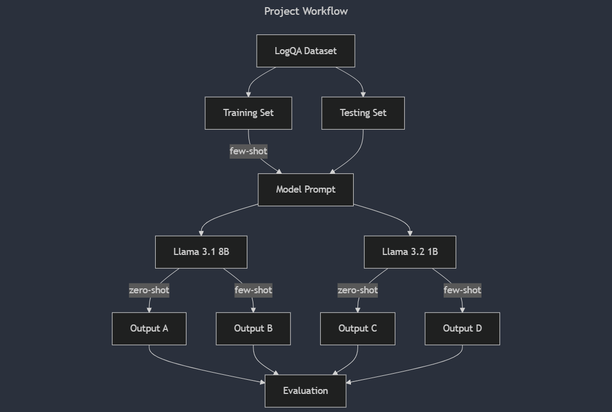

# SLLIM: System Log Local Intelligent Model

## Introduction

In today’s digital age, the widespread adoption of internet-connected devices—ranging from IoT devices to mobile phones has created an unprecedented volume of data. Enterprises, relying on complex systems, face a growing big data challenge in monitoring, managing, and securing system-generated logs. Logging is often critical piece of software, allowing IT professional to track system usage and identify anomalies. In securing those environments, it is crucial to have a robust system log analysis tool that can quickly and accurately identify anomalies, which may include potential threats. Traditional methods rely heavily on static pattern recognition techniques, which often fall short when faced with the dynamic nature of log data, especially in a micro-services environment where logs are aggregated from multiple pieces of software. To address this growing problem, we introduce a novel approach that examines lightweight LLMs for real-time system log analysis via domain-specific question-answering with a specific focus on balancing performance and computational efficiency.

In our efforts to develop this approach, we established two research questions that guide this pursuit.

1. How well can lightweight LLMs detect system issues and security threats from system logs?
2. How effectively can lightweight LLMs perform question answering compared to larger, more resource-intensive models?

After a comprehensive literature review exploring these questions and adjacent research, we sought out a publicly available cybersecurity dataset that would sufficiently represent real-world log traffic. Through our literature review, we identified *Log QA Data*, which offers 832 human-annotated question answer pairs based on publicly available software logs from three common software packages [(Huang et al., 2024a)](#huang2024). A more detailed description of this dataset is presented in the Data Analysis section of this paper.

Armed with annotated data, our experiment focused on evaluating two language models, *Llama 3.1 8B* and *Llama 3.2 1B* [(Llama Team, 2024)](#llama2024). The selection of these models offers a distinct difference in size to allow a clear trend to emerge between them, while loosely controlling confounding variables like model architecture. Moreover, we evaluated both models in zero-shot amd few-shot prompting context to ensure identify performance trends across different prompting techniques. We selected several evaluation metrics to develop a holistic understanding of performance. The evaluation metrics are exact matching, contains matching, token-wise F1-score, and BERT similarity score. The compliments of each of these metrics is discussed further in the evaluation section of this paper. Evaluations revealed several insights into our research questions and provide the primary contributions to this emerging area of research. First, we observed that the larger model only showed marginal performance improvements over the smaller and less resource intensive model. Second, we observed few-shot prompting resulted in a reduced performance across both models. In response, we identified several future research directions to confirm our results, improve our results, and provide further contributions on the efficacy of smaller language models.

## Literature Review

The increasing complexity and size of system logs in the cybersecurity domain has made it challenging for human operators to derive insights quickly. Large language models (LLMs) offer a solution by automating the question-answering (QA) process, enabling rapid information retrieval and analysis. However, the constraints of edge environments, such as limited computational power, necessitate lightweight, efficient models that can be deployed locally. This review synthesizes recent research on deploying optimized LLMs in resource-constrained settings, particularly for real-time or offline QA tasks on cybersecurity logs.

### Deploying LLMs on Edge Devices
The challenge of deploying LLMs on edge devices has driven significant research into adaptation techniques. In their work, "On-Device Language Models: A Comprehensive Review," Wang et al. provide a thorough analysis of strategies such as model quantization and distillation, which reduce model size while preserving accuracy. The study is particularly relevant for on-device analysis as it emphasizes modular LLMs tailored for low-resource environments. This review offers a foundation for deploying compact, modular models on edge devices, providing a crucial starting point for the subsequent discussion of more specialized approaches [(Wang et al., 2024)](#wang2024). Building on the foundations laid by [(Wang et al., 2024)](#wang2024), "Mobile Edge Intelligence for Large Language Models: A Contemporary Survey", [(Kim & Chen, 2024)](#kim2024) explores Mobile Edge Intelligence (MEI) as a framework for deploying LLMs closer to data sources. MEI leverages edge networks, providing a balance of privacy, latency, and computational efficiency, making it suitable for real-time log analysis. The study introduces quantization, pruning, and knowledge distillation as techniques to optimize model performance in resource-constrained environments. Quantization proved particularly insightful and was applied in our own evaluations. Additional research discusses how performance benchmarking plays a key role in understanding the feasibility of deploying LLMs in constrained environments. The study "Mobile Evaluation of Language Transformers" by Nguyen et al. introduces MELT, a benchmarking infrastructure that assesses LLM performance across devices like Android and iOS. This research highlights the trade-offs between throughput, energy consumption, and accuracy degradation due to quantization, which are significant for cybersecurity applications. The quantization methods discussed offer essential insights into memory-efficient deployments, addressing a common limitation in edge computing. Nguyen et al.'s comparative analysis provides baseline performance metrics necessary for evaluating LLM suitability in cybersecurity QA tasks, contributing a practical layer to the discussion on lightweight model deployment [(Nguyen et al., 2024)](#nguyen2024).

### Question Answering on Unstructured Logs
In "LogQA: Question Answering in Unstructured Logs," Huang et al. introduce a QA system specifically designed for extracting information from unstructured logs, an objective closely related to our own. The LogQA system consists of two main components: a Log Retriever, which identifies relevant logs in response to user queries, and a Log Reader, which extracts precise answers from these logs. Although our research focuses less on retrieval, the evaluation strategies presented by Huang et al., including exact match vs. similarity metrics and gold standard comparisons, offer valuable insights into measuring QA system performance. These metrics, along with the LogQA system architecture, serve as a foundation for developing effective QA solutions for system logs [(Huang et al., 2024a)](#huang2024). In "GLOSS: Guiding Large Language Models to Answer Questions from System Logs," Huang et al. present a novel approach to constructing log-based question-answering data using large language models. The system employs a three-step pipeline—question generation, log question answering, and QA pair refinement—to create high-quality QA pairs at scale. By leveraging ChatGPT, GLOSS generates LogQuAD, a comprehensive dataset containing over 28,000 question-answer pairs from more than 31,000 raw logs across 16 different system types—a 34-fold increase compared to existing datasets. Their evaluation demonstrates impressive accuracy with a 92% correctness rate for generated questions and 86% for answers. Through memory-efficient fine-tuning, their 7B parameter model outperforms larger models like LLaMA-65B in log-based QA tasks, while offering insights into template complexity and question type performance [(Huang et al., 2024b)](#huang2024gloss). While the research presented in this proved insightful and influenced our work, the robust dataset described in this research has yet to be made available. 

## Data Analysis

The dataset used in this study originates from the **LogQA** project, which created a collection of question-answer (QA) pairs tailored for research on question answering within the domain of unstructured log data. The dataset encompasses three public log datasets—**HDFS**, **OpenSSH**, and **Spark**—each representing distinct sources of system logs. These datasets were carefully curated to address the challenges posed by the diverse and unstructured nature of log data [(Huang et al., 2024a)](#huang2024).

### Dataset Construction

According to the authors, the dataset construction process began with a selection of 2,000 raw log entries from each log source. To generate question and answer pairs, [*iarfmoose/t5-base-question-generator*](https://huggingface.co/iarfmoose/t5-base-question-generator) question generation model was employed to extract key parameters and events from the logs and formulate corresponding questions. A highlighted example includes the raw log entry "Received block blk_5142679 of size 67108864 from /10.251.70.211" resulted in the question "What is the size of block blk_5142679?" and the answer "67108864." Each QA pair was subsequently reviewed and manually annotated to ensure accuracy and relevance. This rigorous process resulted in a total of 247 QA pairs for HDFS, 188 for OpenSSH, and 397 for Spark. The total of 832 samples were subsequently split into training, validation, and testing subsets and made publicly available at the [LogQA Dataset Repository](https://github.com/LogQA-dataset/LogQA).

### Dataset Structure

The dataset is structured as a collection of JSON objects, where each entry contains a **question**, an **answer**, and the corresponding **context** from which the answer can be inferred. The context for each sample generally reflects a single log entry, which limits the data set to log entry specific question vice questions that apply globally across an entire log and significantly larger context window. This format aligns with common standards in natural language processing (NLP) datasets, enabling integration with existing QA frameworks. 

A typical example from the OpenSSH subset is as follows:

```json
{
  "question": "What did the user fail to enter on the port 42393 ssh2?", 
  "answer": "password", 
  "context": "message repeated 5 times: [ Failed password for root from 5.36.59.76 port 42393 ssh2]"
}
```

In this example, the question asks about a specific failure observed in the logs, the answer is a single word ("password"), and the context provides the full log entry that includes the relevant information. Such a structure ensures that the QA system can identify the correct answer span within a free-text log entry, replicating real-world troubleshooting scenarios for system administrators.

The dataset exhibits a range of question types, with "What" questions being the most prevalent across all datasets. In the HDFS dataset, for example, 88.3% of the questions are of this type, with the remainder including "Where" (11.3%) and other miscellaneous types. The OpenSSH dataset displays a similar pattern, with 92.0% "What" questions, alongside smaller proportions of "Did" (5.9%) and "Who" (1.1%) questions. In contrast, the Spark dataset showcases a broader diversity of questions, such as "How many" (48.6%), "What" (27.0%), and "Is" (18.9%), reflecting the complexity and variety of queries found in this type of query engine software. The structured format and manual curation make the dataset a robust resource for developing and evaluating QA systems for unstructured logs. However, several shortfalls are reviewed in the discussion section of this paper.

## Methodology

As previously discussed, this study aimed to evaluate the performance of lightweight language models in system log question answering (QA) tasks relative to their larger and more prolific counterparts. The experimental design focused on assessing the capabilities of two models: **Llama-3.1-8B**, a large-scale model with 8 billion parameters, and **Llama-3.2-1B**, a lightweight model with 1 billion parameters. 

The model prompting stage involves creating structured inputs for the models, including the context, question, and optionally, few-shot examples from the training set. These prompts are then processed by the two models independently. In the **zero-shot configuration**, no prior examples were included. The input consisted solely of the context (the raw log entry) and the question, with the expectation that the model would generate an accurate answer without additional guidance. This setup aimed to evaluate the models’ innate ability to generalize across unseen tasks and data. In the **few-shot configuration**, two examples from the training set were included in each prompt to provide context. Few-shot learning, or in-context learning, enables language models to perform new tasks by providing a few examples of input-output pairs directly within the prompt, without requiring parameter updates or retraining. This approach allows the model to infer patterns and generate responses based on the context provided in the examples. The two examples we provided the model in each prompt were sources from the training set and consisted of a sample log entry, a question, and its corresponding answer.

```json
"context": "Invalid user admin from 119.4.203.64"
"question": "What is the IP address of the user admin?",
"answer": "119.4.203.64",

"context": "Block broadcast_24_piece0 stored as bytes in memory (estimated size 5.6 KB, free 393.0 KB)",
"question": "How many kb is broadcast_24_piece0 free?",
"answer": "393.0"

"context": "PacketResponder 2 for block blk_8229193803249955061 terminating",
"question": "What is the name of the packet that is used to terminate a block blk_8229193803249955061?",
"answer": 
```

After each model generates outputs under both zero-shot and few-shot configurations, resulting in four distinct outputs: Output A and Output B from Llama 3.1 8B, and Output C and Output D from Llama 3.2 1B. These outputs are subsequently passed through an evaluation stage discussed in the next section.

Both models were accessed via [HuggingFace](https://huggingface.co/meta-llama), with quantization for efficient GPU usage. Quantization is a technique used to reduce the memory and computational requirements of models by representing parameters with lower precision. We used 16-bit floating-point values instead of 32-bit floating-point values using `BitsAndBytesConfig`. For an 8-billion-parameter model using 32-bit precision (FP32), each parameter requires 4 bytes of storage. This results in a total size of roughly 32 gigabytes. When the precision is reduced to 16 bits (FP16), each parameter requires only 2 bytes, effectively halving the memory requirements. This approach maintains acceptable model performance while significantly improving efficiency. Emphasis on efficient GPU usage was taken for two reasons. First, model efficiency is inherent in our research as we seek to inform deployments to edge devices or low-cost environments. Second, we sought to make our experiment repeatable on consumer-grade hardware. For this experiment, inference was conducted on one [NVIDIA GeForce RTX 2060](https://www.nvidia.com/en-gb/geforce/graphics-cards/compare/?section=compare-20).



### Evaluation Methods

Evaluating the performance of Question Answering (QA) systems necessitates a multifaceted approach, employing both exact and semantic metrics to capture the nuances of model responses. This study utilized four key metrics: Exact Match (EM), Contains Match (CM), Token-Based F1, and BERTScore, each offering distinct insights into the models' QA capabilities.

**Exact Match (EM)** is a stringent metric that assesses the binary correctness of a generated answer by determining whether it exactly matches the ground truth. This metric is particularly useful for evaluating precise, single-token answers often found in log data. However, its rigidity can overlook semantically correct answers that differ in phrasing. 

**Contains Match (CM)** evaluates whether the generated answer includes the ground truth answer, accommodating cases where slight variations in phrasing or additional context are present. This metric provides a more lenient assessment compared to EM, capturing partial correctness in responses.

**Token-Based F1** measures the overlap between the generated answer and the ground truth at the token level, calculating precision and recall to account for partial matches. This approach is well-suited for noisy or complex answers, offering a balanced evaluation of both the accuracy and completeness of the response. 

**BERTScore** assesses the semantic similarity between the generated answer and the ground truth using pre-trained embeddings from models like BERT. By capturing contextual nuances, BERTScore provides insights into the semantic fidelity of the models’ responses, even when surface-level mismatches occur [(Chen et al., 2019)](#chen2019). 

Employing this combination of metrics allows for a comprehensive evaluation of QA systems. While EM and CM focus on exact and partial lexical matches, Token-Based F1 and BERTScore delve into the semantic accuracy of responses. This approach offers insights into both the precision and the underlying meaning of the answers are appropriately assessed, offering a holistic view of model performance. The results of each evaluation metric were stored in structured JSON format, including metadata such as the context, question, and generated answer. This ensured traceability and facilitated downstream analysis of the models’ performance. This method also allowed us to pinpoint potentially problematic samples in the dataset discussed further in a later section of this paper.

## Results

The performance of the models across configurations is summarized in Table 1. The **Llama-3.1-8B** model demonstrated marginally better performance than **Llama-3.2-1B** in both configurations, particularly in Exact Match and BERTScore. However, the **Llama-3.2-1B** model achieved competitive results in Token-Based F1 and Contains Match metrics, underscoring the effectiveness of lightweight models for log-based QA tasks.

### Table 1: Performance Metrics for Llama Models in LogQA

| Metric                  | Llama-3.1-8B ZS | Llama-3.2-1B ZS | Llama-3.1-8B FS | Llama-3.2-1B FS |
|-------------------------|-----------------|-----------------|-----------------|-----------------|
| **Exact Match (EM)**    | 0.00            | 0.02            | 0.01            | 0.02            |
| **Contains Match (CM)** | 0.71            | 0.58            | 0.51            | 0.62            |
| **Token F1**            | 0.16            | 0.22            | 0.16            | 0.20            |
| **BERTScore**           | 0.83            | 0.82            | 0.77            | 0.79            |

## Discussion

### Performance Trends and Implications for Model Size

The results reveal that while **Llama-3.1-8B**, the larger model, achieved slightly higher BERTScore values compared to its smaller counterpart, **Llama-3.2-1B**, the difference in performance was minimal. This finding is particularly significant given the disparity in model size and computational resources required for inference. It suggests that lightweight models are increasingly competitive in specialized domains such as system log question answering. This competitiveness not only highlights the efficiency of smaller models but also raises questions about the diminishing returns of scaling model size for tasks requiring domain-specific applications and the potential for smaller task-specific agents. Further research into fine-tuning techniques or task-specific adaptations for lightweight models could help narrow the performance gap, potentially making them more attractive for deployment in resource-constrained environments.

### Impact of Prompting Strategies

The degradation of performance observed in the few-shot prompting configuration, especially for the larger model, presents a noteworthy trend. Unlike zero-shot prompting, which relies solely on the provided context and question, few-shot prompting introduced examples from the training set within each prompt. This additional context, while intended to guide the model, may have inadvertently introduced noise or complexity. Furthermore, the experimental design employed standard few-shot examples without leveraging the widely adopted instruction-question-context (IQC) pattern, which combines explicit task instructions with examples and the main question. Incorporating IQC-style prompting in future experiments may help reduce the observed performance degradation by providing clearer guidance and disambiguating the task for the model.

### Challenges in Evaluating Technical Outputs

The evaluation of model responses, particularly for technical outputs such as IP addresses or port numbers, presented unique challenges. Metrics like BERTScore rely on word-piece tokenization and semantic similarity to compare generated answers with ground truth. While effective for natural language tasks, this approach may be insufficient for assessing the correctness of discrete technical values. For instance, a semantically similar but incorrect IP address would still receive a high BERTScore, despite being objectively wrong. This limitation underscores the use of multiple evaluation metrics that account for the nuances of question answering.

### Broader Implications

These findings contribute to ongoing discussions about the scalability of language models and their application in domain-specific tasks. The diminishing performance gap between large and small models suggests that advances in model architecture, pre-training, or task adaptation may eventually overshadow the need for excessively large models in many practical applications such as log analysis. Additionally, the challenges associated with prompting strategies and evaluation metrics underscore the importance of broad methodologies to the specific demands of domains like unstructured logs. These considerations guide future research covered in the next section.

## Future Works

### Expanding Cybersecurity Domain Knowledge

While this study demonstrated the utility of lightweight and large-scale models in answering questions derived from system logs, its applicability to cybersecurity remains limited by the dataset’s scope. Future work should address this shortfall by integrating domain knowledge specific to cybersecurity, particularly indicators and warnings of potential threats. Basic question answering is a strong foundation, but the inclusion of enriched datasets with annotated cybersecurity-specific questions would enable the development of systems capable of more impactful real-world applications, such as identifying patterns of malicious behavior or correlating disparate log entries to detect advanced threats.

### Enhancing Contextual Reasoning

The current experimental design focused on question answering within the scope of individual log entries. This is effective for evaluating reasoning capabilities, but falls short of reflecting real-world use cases where logs may contain thousands of entries. Practical applications often require reasoning across multiple log entries or integrating information retrieval methods to identify and aggregate relevant data. Expanding the dataset to include global question-answer pairs that span multiple logs, or leveraging model prompts that take advantage of larger context windows would better simulate the complexity of real-world deployments.

### Exploring Fine-Tuning for Task-Specific Optimization

This study relied solely on in-context learning without incorporating fine-tuning, limiting the potential optimization of models for the specific domain of system log analysis. Future research should explore fine-tuning models on log-specific or cybersecurity-specific datasets to better capture domain nuances and improve performance. Fine-tuning has the potential to enhance the models' ability to generalize across complex log-based questions while reducing dependency on extensive prompt engineering, making them more robust and efficient in real-world scenarios.

### Investigating Model Size Reduction Techniques

While this study demonstrated the competitive performance of lightweight models relative to larger counterparts, the potential of size reduction techniques such as quantization may provide greater insights. Future experiments should systematically evaluate different degrees of quantization to determine the trade-offs between model size and performance. This approach would help reveal the limits of model compression and identify configurations that optimize the balance between computational efficiency and task performance. Such findings could further support the adoption of lightweight models in resource-constrained environments, such as edge devices or systems with limited processing capabilities.

## References

- <a id="wang2024"></a>[Wang, L., Johnson, R., & Lee, M. (2024). On-Device Language Models: A Comprehensive Review. *ACM Computing Surveys*, 57(3), 1-38.](https://arxiv.org/abs/2409.00088)

- <a id="llama2024"></a>[Llama Team. (2024). The Llama 3 Herd of Models: Advancements in Foundation AI Models. *AI@Meta*](https://llama.meta.com/)

- <a id="kim2024"></a>[Kim, Y., & Chen, S. (2024). Mobile Edge Intelligence for Large Language Models: A Contemporary Survey. *IEEE Communications Surveys & Tutorials*, 26(2), 1123-1159.](https://arxiv.org/abs/2407.18921)

- <a id="nguyen2024"></a>[Nguyen, T., Patel, A., & Gomez, C. (2024). Mobile Evaluation of Language Transformers. In *Proceedings of the 37th Annual ACM Symposium on Applied Computing* (pp. 912-921).](https://icml.cc/virtual/2024/39628)

- <a id="huang2024"></a>[Huang, P., Lin, X., & Xu, D. (2024a). LogQA: Question Answering in Unstructured Logs. In *Proceedings of the 2024 Conference on Empirical Methods in Natural Language Processing* (pp. 3782-3794).](https://arxiv.org/abs/2410.11845) 

- <a id="huang2024gloss"></a>[Huang, S., Liu, Y., Qi, J., Shang, J., Xiao, Z., Fung, C., Wu, Z., Yang, H., Luan, Z., & Qian, D. (2024b). GLOSS: Guiding Large Language Models to Answer Questions from System Logs. In 2024 IEEE International Conference on Software Analysis, Evolution and Reengineering (SANER) (pp. 91-101).](https://ieeexplore.ieee.org/document/10589781).

- <a id="chen2019"></a>[Chen, X., Fisch, A., Weston, J., & Bordes, A. (2019). Evaluating Question Answering Evaluation. *Proceedings of the 2019 Conference on Empirical Methods in Natural Language Processing and the 9th International Joint Conference on Natural Language Processing (EMNLP-IJCNLP)*, 2318–2327.](https://aclanthology.org/D19-5817)
