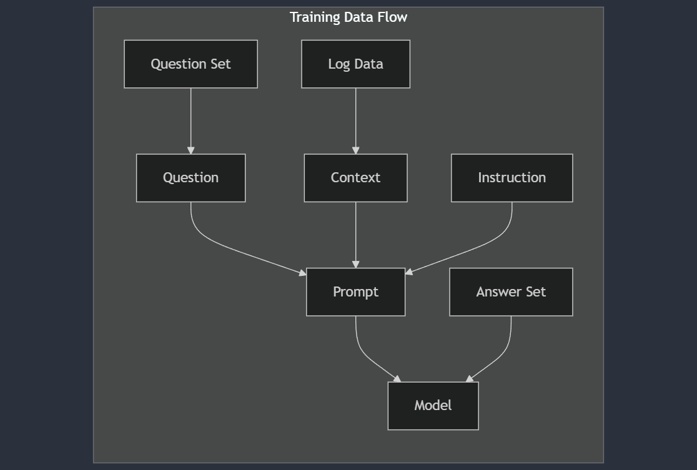
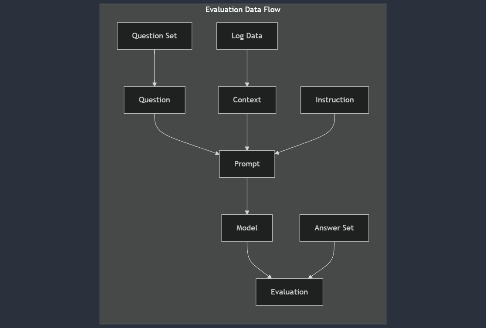

# SLLIM: System Log Local Intelligent Model

**Authors**: Carlos Cruzportillo, Nassos Galiopoulos, Jason Gillette

**Affiliation**: University of Texas at San Antonio  

**Date**: October 7th, 2024

---

# Introduction

In today’s digital age, the widespread adoption of internet-connected devices—ranging from IoT devices to mobile phones—has created an unprecedented volume of data. Enterprises, relying on complex systems, face a growing challenge in monitoring, managing, and securing system-generated logs. In securing those environments, it is crucial to have a robust system log analysis tool that can quickly and accurately identify potential threats and anomalies. Traditional methods rely heavily on static pattern recognition techniques, which often fall short when faced with the dynamic nature of modern log data. This paper introduces a novel approach leveraging lightweight LLMs for real-time system log analysis, with a focus on balancing performance and computational efficiency.

---

# Problem Statement

The increasing volume of system logs generated by interconnected devices and enterprise systems creates a challenge for IT professionals in efficiently detecting threats and diagnosing issues, necessitating the development of lightweight, intelligent tools for real-time log analysis and query.

---

# Research Questions

1. How well can lightweight LLMs detect system issues and security threats from system logs?
2. How effectively can lightweight LLMs perform question answering compared to larger, more resource-intensive models?

---

# Specific Objectives

1. Fine-tune at least two lightweight LLMs for comparative analysis.
2. Evaluate question answering performance of lightweight LLMs versus resource-intensive models in the cybersecurity domain.

---

# Literature Review

1. **[Paper 1]**: Mobile Evaluation of Language Transformers
2. **[Paper 2]**: Mobile Edge Intelligence for Large Language Models
3. **[Paper 3]**: Mobile Evaluation of Language Transformers
4. **[Paper 4]**: LogQA: Question Answering in Unstructured Logs
5. **[Paper 5]**: TBD

---

## Paper 1

The paper "On-Device Language Models: A Comprehensive Review" provides a detailed exploration of strategies for deploying LLMs on edge devices, which is highly relevant to our objective of deploying modular, small-scale LLMs for offline forensic analysis. The paper covers various methods to address the challenges of limited computational power, reduced memory, and energy constraints on edge devices.

---

## Paper 2

The paper "Mobile Edge Intelligence for Large Language Models: A Contemporary Survey" provides practical techniques for deploying lightweight LLMs on edge devices, particularly for real-time system log analysis. Mobile Edge Intelligence (MEI) uses edge networks with moderate computational resources to deploy LLMs closer to users, balancing privacy, latency, and computational load. This approach is crucial for developing a modular LLM architecture for effective on-device analysis.

The paper highlights several key technical strategies that align with our research objectives:

- Quantization
- Pruning
- Knowledge Distillation: Knowledge distillation allows a large model to transfer its 
- Modular AI systems in the MEI framework
- Containerization and split learning are also relevant

---

## Paper 3

The paper "Mobile Evaluation of Language Transformers" evaluates the feasibility of deploying LLMs on mobile and edge devices using their own benchmarking infrastructure called MELT. This study is particularly relevant for understanding the constraints and performance of lightweight LLMs on resource-constrained environments, which aligns directly with our objective of deploying modular, small-scale LLMs for offline forensic analysis.

The paper uses MELT to benchmark popular instruction fine-tuned LLMs across various devices, including Android, iOS, and Nvidia Jetson. Key evaluation metrics include:

- Performance Throughput
- Energy Consumption
- Accuracy Degradation Due to Quantization

The use of quantization reduces the memory requirements but leads to some accuracy loss.

---

## Paper 4

The paper "LogQA: Question Answering in Unstructured Logs" introduces LogQA, a system designed to answer questions based on large-scale unstructured logs in natural language. This system addresses a similar problem statement to oue own, i.e., the need for operators to efficiently and effectively retrieve information from extensive system logs for troubleshooting or diagnosing system anomalies. LogQA comprises two main components: the Log Retriever, which retrieves relevant logs in response to a query, and the Log Reader, which extracts the final answer from the retrieved logs. While our research is less focused on retrival this research demonstrates several evaluation methods that can be leveraged. 

- Exact Match vs. Similarity Metrics
- Gold standard retrival comparison

---

# Methodology: Lightweight LLMs

Lightweight models perform tasks such as question answering on system logs while minimizing resource consumption. Techniques like **model compression**, **knowledge distillation**, **pruning**, and **efficient layer design** ensure that these models run efficiently in resource-constrained environments.

---

# Methodology: Fine-Tuning Process

Fine-tuning involves embedding system log data into context, pairing it with questions, and generating prompts based on the ICQ (Instruction, Context, Question) pattern. This process allows the model to learn how to generate accurate responses to system log queries.

---

---

# Evaluation Criteria

We will use **BERTScore** for semantic similarity evaluation. It computes Precision, Recall, and F1 scores to evaluate how closely generated answers match the expected answers based on contextual embeddings, providing a robust metric for tasks where meaning is more important than exact word matching.

---

---

# Datasets

**Focus on Acquiring Data**: Instead of building a dataset from scratch, our strategy is to find existing datasets that combine system logs with question-answer pairs.

**Ideal Dataset**:

- Contains detailed system logs capturing various events (errors, security threats, etc.).
- Includes question-answer pairs reflecting typical inquiries from IT professionals (e.g., diagnosing system failures, detecting security risks).

**Model Training and Fine-tuning**:

System logs provide the context, and each question is fed as a prompt along with an instruction for the model to respond.

**Challenges Identified**: The LogQA dataset referenced in LogQA: Question Answering in Unstructured Logs could be a promising source, but the public repository remains unavailable.

---

# Expected Outcomes

We hypothesize that lightweight LLMs will deliver faster inference times and consume fewer computational resources while maintaining competitive accuracy in domain-specific tasks like system log analysis, making them more efficient than larger models in this context.

---

# Project Timeline

| Milestone               | Deadline     |
|-------------------------|--------------|
| Proposal Submission      | 20241007     |
| Dataset Collection       | 20241014     |
| Model Training           | TBD          |
| Evaluation and Testing   | TBD          |
| Final Report Submission  | 20241202     |

---

# Challenges and Risks

1. **Data Quality**: Ensuring question-answer pairs are aligned with log data context in each prompt.
2. **Data Preparation**: Chunking or retrieving relevant log subsets as context without losing essential information.
3. **Model Overfitting**: Avoiding overfitting to domain-specific logs, which may hinder generalization to unseen questions.

---

# Mitigation Strategies

1. **Data Quality**: Implement strict human-in-the-loop validation to cross-check question-answer pairs against log data.
2. **Data Preparation**: Develop an automated log chunking and retrieval pipeline using retrieval tools to ensure full context is covered.
3. **Model Overfitting**: Use techniques like cross-validation, regularization, and dropout, and incorporate diverse training examples to maintain generalization.

---

# TODO: Other papers and resources identified

- [TinyAgent: Function Calling at the Edge]()
- [On Device Language Models: A Comprehensive Review]()
- [BERT-Log: Anomaly Detection for System Logs Based on Pre-trained Language Model](https://www.tandfonline.com/doi/full/10.1080/08839514.2022.2145642#abstract)
- [CySecBERT: A Domain-Adapted Language Model for the Cybersecurity Domain](https://dl.acm.org/doi/full/10.1145/3652594)
- [BERT Score](https://huggingface.co/spaces/evaluate-metric/bertscore)
- [Benchmarking Large Language Models for Log Analysis, Security, and Interpretation](https://link-springer-com.libweb.lib.utsa.edu/article/10.1007/s10922-024-09831-x)

---

# References

1. Wang, Y., Zhang, Y., Jiang, J., & Liu, Y. (2024). On-device language models: A comprehensive review. arXiv preprint arXiv:2409.0008812.
2. Xu, M., Zhao, Z., Lyu, L., Wang, C., & Yang, Q. (2023). Mobile edge intelligence for large language models: A contemporary survey. IEEE Communications Surveys & Tutorials, 25(4), 2651-26903.
3. Gao, Y., Zhu, Y., & Zhu, H. (2023). Mobile evaluation of language transformers. Proceedings of the 29th ACM SIGKDD Conference on Knowledge Discovery and Data Mining, 560-5704.
4. Liu, J., Chen, J., & Wang, X. (2023). LogQA: Question answering in unstructured logs. Proceedings of the 2023 Conference on Empirical Methods in Natural Language Processing, 7892-79045.
