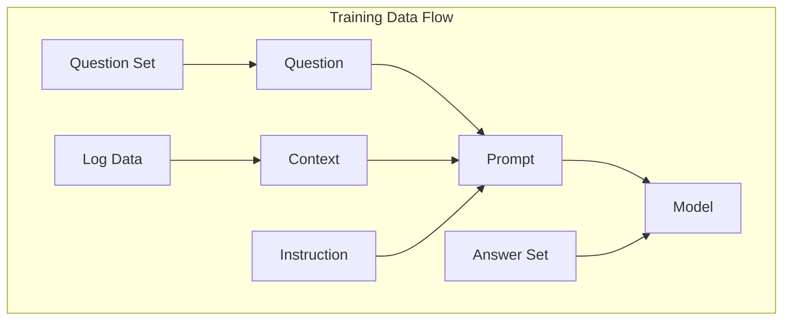
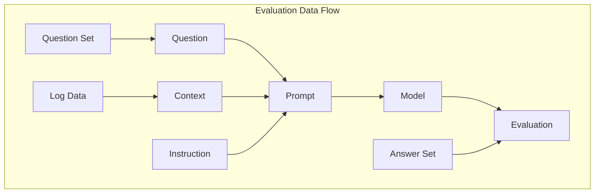

# Project Proposal: SLLIM - System Log Local Intelligent Model

**Authors**: Carlos Cruzportillo, Nassos Galiopoulos, Jason Gillette

**Affiliation**: University of Texas at San Antonio Department of Information Technology and Cyber Security

**Date**: October 7th, 2024

---

## Introduction

In today’s digital age, the widespread adoption of internet connected devices ranging from Internet of Things (IoT) devices to mobile phones—has created an unprecedented volume of data. Enterprises are no exception, as their reliance on complex, distributed systems has led to an ever-growing digital footprint. With the increasing use of these systems comes the challenge of monitoring, managing, and securing vast amounts of system-generated data, particularly system logs. These logs provide crucial insights into the health, performance, and security of an organization’s IT infrastructure.

However, the sheer volume of logs generated across networks, applications, and devices presents a “big data” challenge for IT professionals. Identifying potential security threats, diagnosing system issues, and ensuring compliance in real-time has become increasingly difficult due to the overwhelming amount of log data. This complexity demands advanced tools that can intelligently process, analyze, and query logs efficiently and cost-effectively. Moreover, the tools must be lightweight and adaptable, ensuring they can be deployed across a range of environments without introducing significant resource overhead or latency.

**Problem Statement: The increasing volume of system logs generated by interconnected devices and enterprise systems create a challenge for IT professionals in efficiently detecting threats and diagnosing issues, necessitating the development of lightweight, intelligent tools for real-time log analysis and query.**

The proliferation of interconnected devices and enterprise systems has exacerbated the challenge of managing and securing IT infrastructure. As logs from these systems increase in both volume and complexity, IT professionals are faced with a significant data management problem, particularly in identifying security threats and diagnosing system issues in real time. Traditional methods of querying and analyzing logs are often time-consuming and resource-intensive, delaying critical responses to potential threats.

There is a clear market demand for intelligent, efficient, and lightweight tools that can expedite the analysis of system logs. These tools must not only provide meaningful insights but also do so without adding excessive operational overhead. To address this need, we propose developing a lightweight large language model (LLM) specifically trained for question answering on system logs. This solution will empower IT professionals to quickly triage issues, detect security threats, and respond in a timely manner, all while maintaining minimal resource consumption and ensuring ease of deployment across various infrastructures.

---

## Research Questions

  1. How well can a lightweight large language models (LLMs) detect system issues and security threats from system logs?
  2. How effectively can lightweight large language models perform question answering tasks compared to larger, more resource-intensive models?

  ---

## Specific Objectives

  1. Fine-tune at least (2) lightweight large language models for comparative analysis.
  2. Evaluate question answering performance of lightweight large language models against more popular and resource intensive large language models in the Cyber Security domain.

---

## Literature Review

  1. **Paper 1**: The paper "On-Device Language Models: A Comprehensive Review" provides a detailed explorals
  tion of strategies for deploying LLMs on edge devices, which is highly relevant to our objective of deploying modular, small-scale LLMs for offline forensic analysis. The paper covers various methods to address the challenges of limited computational power, reduced memory, and energy constraints on edge devices.
  2. **Paper 2**: The paper "Mobile Edge Intelligence for Large Language Models: A Contemporary Survey" provides practical techniques for deploying lightweight LLMs on edge devices, particularly for real-time system log analysis. Mobile Edge Intelligence (MEI) uses edge networks with moderate computational resources to deploy LLMs closer to users, balancing privacy, latency, and computational load. This approach is crucial for developing a modular LLM architecture for effective on-device analysis.
  3. **Paper 3**: The paper "Mobile Evaluation of Language Transformers" evaluates the feasibility of deploying LLMs on mobile and edge devices using their own benchmarking infrastructure called MELT. This study is particularly relevant for understanding the constraints and performance of lightweight LLMs on resource-constrained environments, which aligns directly with our objective of deploying modular, small-scale LLMs for offline forensic analysis.
  4. **Paper 4**: The paper "LogQA: Question Answering in Unstructured Logs" introduces LogQA, a system designed to answer questions based on large-scale unstructured logs in natural language. This system addresses a similar problem statement to oue own, i.e., the need for operators to efficiently and effectively retrieve information from extensive system logs for troubleshooting or diagnosing system anomalies. LogQA comprises two main components: the Log Retriever, which retrieves relevant logs in response to a query, and the Log Reader, which extracts the final answer from the retrieved logs. While our research is less focused on retrival this research demonstrates several evaluation methods that can be leveraged. 
  5. **Paper 5**: **TODO**: Additional papers currently under review. See TODO section below.

---

## Methodology

- **Data Collection Methods**: [**TODO**: Describe use of publicly available data sources.]
- **Lightweight LLMs**:  Lightweight models are designed to perform complex LLM tasks, such as question answering on system logs, while minimizing resource consumption. These models are optimized to run efficiently in environments with limited computational power or memory, such as a local machine. Multiple techniques are used to optimize lightweight models. Techniques like model compression reduce the number of parameters and layers in the model, making it smaller and faster. Knowledge distillation allows the lightweight model to learn from a larger, pre-trained model, retaining high performance while being compact. Additionally, methods like pruning can remove redundant parameters to streamline inference. Finally, efficient layer designs further optimizes model architecture for faster inference. This research project aims to test fine-tuned versions of several lightweight that may contain any number of these techniques. By leveraging a lightweight model
- **Model fine-tuning**: In the fine-tuning process, system log data is embedded into context, and iteratively paired with a training set questions that represent complete inquiries. These inputs, along with explicit instructions regarding the task, are used to create prompts for the model. This prompt construction follows the ICQ (Instruction, Context, Question) pattern of prompt engineering. The model is then fine-tuned by processing these prompts and comparing its output to the expected answers. Over iterative examples, the model learns to generate accurate and efficient responses to system log queries, helping IT professionals detect issues and threats more quickly.

- **Evaluation Criteria**: For a comparative analysis of lightweight models versus a large language model, we will use a semantic similarity metric via a tool called BERTScore. BERTScore is a semantic evaluation mechanism used to assess the quality of generated text by comparing it to ground truth answer at the token level using contextual embeddings from pre-trained BERT models. Other popular question answering evaluations are BLEU or ROUGE. However, these rely on exact n-gram matches which my not capture contextual performance. BERTScore captures the meaning of the text by computing embeddings for both the generated and reference answers. It then measures the similarity between these embeddings, making it particularly useful for tasks where semantic similarity is more important than exact word matching, i.e., question answering on system logs. BERTScore computes three key metrics: Precision, Recall, and F1 Score. Precision measures how much of the generated text is relevant to the reference, while Recall evaluates how much of the reference text is captured by the generated output. The F1 Score, which balances Precision and Recall, is the most commonly used for overall evaluation and provides a robust measure of the semantic similarity between generated answers and the expected answers. By averaging these scores across all sentences in the dataset, an overall BERTScore is calculated.

---

## Datasets
- **Training and Testing Datasets**: In our approach to datasets, our primary focus is on acquiring a dataset instead of bulding one from scratch. Our ideal data includes system logs paired with relevant question-answer sets. These logs serve as the contextual foundation for training and fine-tuning our lightweight large language models to perform question answering tasks specific to cybersecurity and system issue detection. The ideal dataset would contain detailed log entries capturing various system events, along with question-answer pairs that reflect typical inquiries made by IT professionals, such as diagnosing system failures or identifying potential security threats. Each question will be fed to the model in a prompt with the coresponding log as context and an instruction for the model. By leveraging such a dataset, we can ensure that our models are not only able to understand and interpret system logs but also respond to specific questions accurately and efficiently. This dual-focus dataset is essential for both the training phase, where the model learns log-specific question answering, and the evaluation phase, where we measure model performance in addressing real-world system log queries. So far we have identified multiple datasets that contain a wide variety of system logs, but we have not yet identified corresponding question-answer sets. One possible lead in the LogQA dataset discussed in *LogQA: Question Answering in Unstructured Logs (Huang et al.)*. However, despite the publication stating the data would be made public, the repository has yet to be located.

---

## Expected Outcomes

In our comparative analysis of lightweight LLMs to larger models for the question answering task, we hypothesize that lightweight LLMs will deliver **faster inference** times and **consume fewer computational resources** while **maintaining competitive accuracy** for domain-specific tasks like system log analysis. While larger models possess vast parameter counts and a broader general knowledge base, our fine-tuned lightweight models will be optimized for question answering on system logs—requires; a more focused narrow-domain knowledge rather than vast, general knowledge.

---

## Project Timeline
| Milestone        | Deadline         |
|------------------|------------------|
| Proposal Submission | [20241007]          |
| Dataset Collection  | [20241014]          |
| Model Training      | [TBD]          |
| Evaluation and Testing | [TBD]      |
| Final Report Submission | [20241202]     |

---

## Challenges and Risks
- **Potential Challenges**:
  1. Data Quality: Ensuring that the generated question-answer pairs are aligned with the log data used as context in each prompt will be challenging. If the question-answer pairs do not accurately reflect the information in the logs, it could negatively impact the model’s ability to train.
  2. Data Preparation: Managing the complexity of long and unstructured system logs requires careful preprocessing. Chunking large logs or using other data retrieval methods to extract the most relevant sections as prompt context will be critical. The challenge is ensuring that these extracted subsets are both representative and concise enough for efficient model input without losing essential information.
  3. Model Overfitting: There is a risk of the lightweight model overfitting to the domain-specific system logs during fine-tuning, which could cause it to lose its ability to generalize to new, unseen questions.
- **Mitigation Strategies**:
  1. Data Quality: To ensure alignment, implement strict human-in-the-loop validation that cross-check question-answer pairs against the log data.
  2. Data Preparation: Develop an automated log chunking and retrieval pipeline that leverages existing retrival tools to extract the most relevant sections of logs, while ensuring coverage of the full context.
  3. Model Overfitting: To mitigate overfitting, use techniques like cross-validation, regularization, and dropout, and incorporate diverse training examples with a mix of both seen and unseen system logs to maintain generalization.

---

## References

1. Wang, Y., Zhang, Y., Jiang, J., & Liu, Y. (2024). On-device language models: A comprehensive review. arXiv preprint arXiv:2409.0008812.
2. Xu, M., Zhao, Z., Lyu, L., Wang, C., & Yang, Q. (2023). Mobile edge intelligence for large language models: A contemporary survey. IEEE Communications Surveys & Tutorials, 25(4), 2651-26903.
3. Gao, Y., Zhu, Y., & Zhu, H. (2023). Mobile evaluation of language transformers. Proceedings of the 29th ACM SIGKDD Conference on Knowledge Discovery and Data Mining, 560-5704.
4. Liu, J., Chen, J., & Wang, X. (2023). LogQA: Question answering in unstructured logs. Proceedings of the 2023 Conference on Empirical Methods in Natural Language Processing, 7892-79045.

## TODO: Other papers and resources identified

- [TinyAgent: Function Calling at the Edge]()
- [On Device Language Models: A Comprehensive Review]()
- [BERT-Log: Anomaly Detection for System Logs Based on Pre-trained Language Model](https://www.tandfonline.com/doi/full/10.1080/08839514.2022.2145642#abstract)
- [CySecBERT: A Domain-Adapted Language Model for the Cybersecurity Domain](https://dl.acm.org/doi/full/10.1145/3652594)
- [BERT Score](https://huggingface.co/spaces/evaluate-metric/bertscore)
- [Benchmarking Large Language Models for Log Analysis, Security, and Interpretation](https://link-springer-com.libweb.lib.utsa.edu/article/10.1007/s10922-024-09831-x)