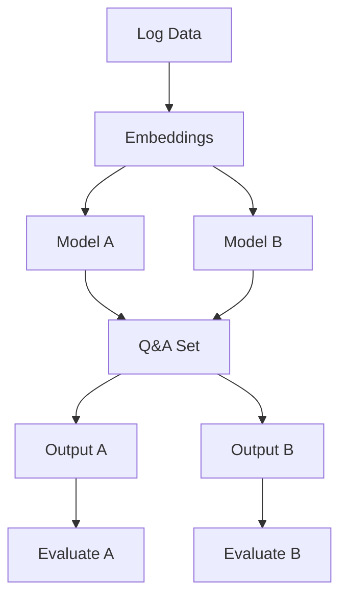

# Project Proposal: SLLIM - System Log Local Intelligent Model

**Authors**: Carlos Cruzportillo, Nassos Galiopoulos, Jason Gillette

**Affiliation**: University of Texas at San Antonio Department of Information Technology and Cyber Security

**Date**: October 7th, 2024

---

## Introduction
- **Problem Statement**: [Describe the problem or motivation for this research]
- **Goals/Objectives**: [List the main goals or objectives of the project]
- **Importance of the Research**: [Explain why this research is significant]

---

## Objectives
- **Research Questions**:
  1. [First research question]
  2. [Second research question]
- **Specific Objectives**:
  1. [First objective]
  2. [Second objective]

---

## Literature Review
- **Related Papers**:
  1. **Paper 1**: [Brief summary and relevance]
  2. **Paper 2**: [Brief summary and relevance]
  3. **Paper 3**: [Brief summary and relevance]
  4. **Paper 4**: [Brief summary and relevance]
  5. **Paper 5**: [Brief summary and relevance]

---

## Methodology
- **Data Collection Methods**: [Describe how you will collect or source data]
- **NLP Techniques and Tools**:
  - Lightweight LLMs: [Explain model choice]
  - Tokenization: [Describe the tokenization process]
  - Model fine-tuning: [Explain how you will adapt the model to system logs]
- **Evaluation Criteria**:
  - Accuracy: [Describe how accuracy will be measured]
  - Resource Efficiency: [Outline how model efficiency will be evaluated]

---

## Datasets
- **Training and Testing Datasets**:
  - Dataset 1: [Description]
  - Dataset 2: [Description]
- **Justification for Dataset Choice**: [Explain why these datasets are relevant]
- **Preprocessing Steps**:
  - Log cleaning: [Explain how data will be cleaned]
  - Tokenization: [Describe any tokenization-specific steps]

---

## Tools and Technologies
- **Programming Languages**: [e.g., Python]
- **Libraries and Frameworks**: [e.g., PyTorch, HuggingFace Transformers]
- **Compute Resources**: [Local deployment, cloud resources, etc.]

---

## Expected Outcomes
- **Key Outcomes**:
  1. [Expected outcome 1]
  2. [Expected outcome 2]
- **Model Performance**: [Hypothesize how lightweight LLMs will perform compared to larger models]

---

## Project Timeline
| Milestone        | Deadline         |
|------------------|------------------|
| Proposal Submission | [Date]          |
| Dataset Collection  | [Date]          |
| Model Training      | [Date]          |
| Evaluation and Testing | [Date]      |
| Final Report Submission | [Date]     |

---

## Challenges and Risks
- **Potential Challenges**:
  - [Challenge 1]
  - [Challenge 2]
- **Mitigation Strategies**:
  - [Strategy for Challenge 1]
  - [Strategy for Challenge 2]

---

## References
1. [Reference for Paper 1]
2. [Reference for Paper 2]
3. [Reference for Paper 3]
4. [Reference for Paper 4]
5. [Reference for Paper 5]