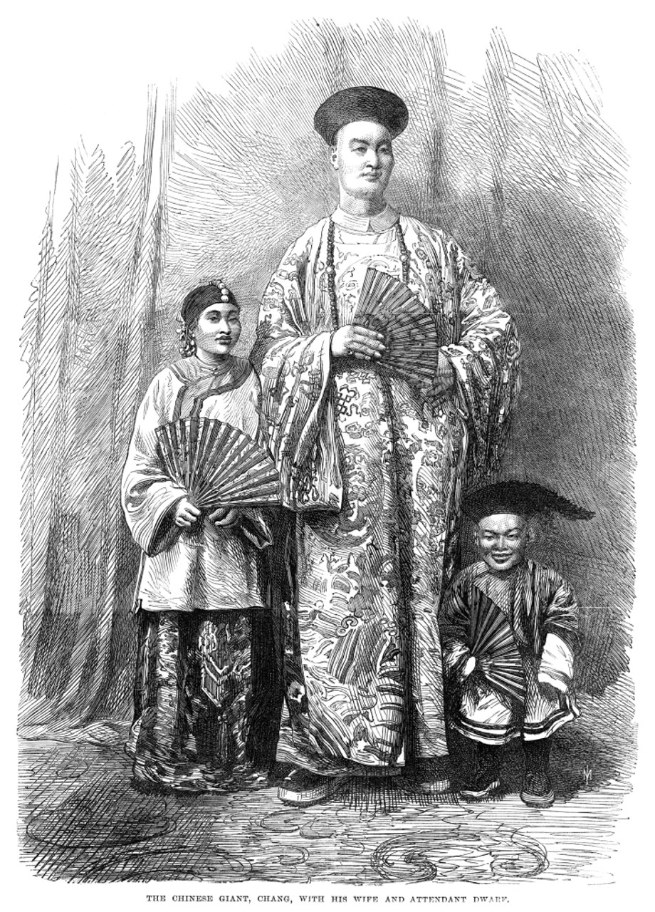
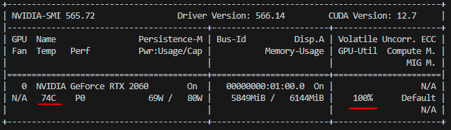
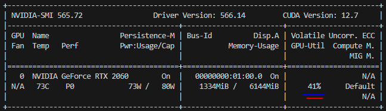
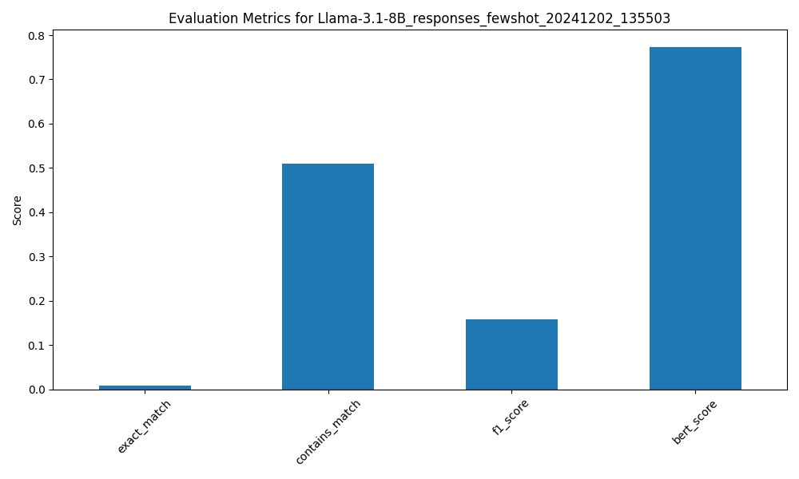
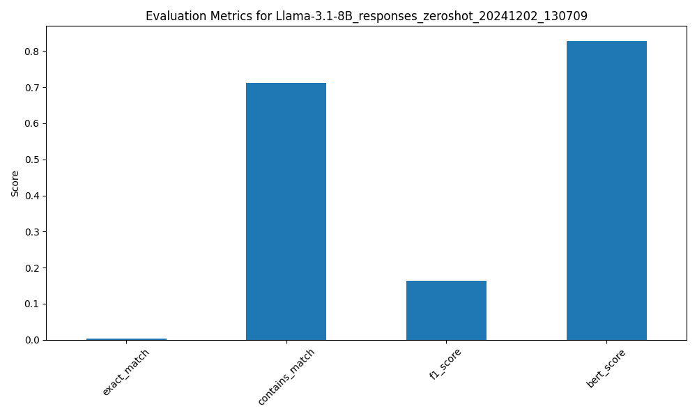
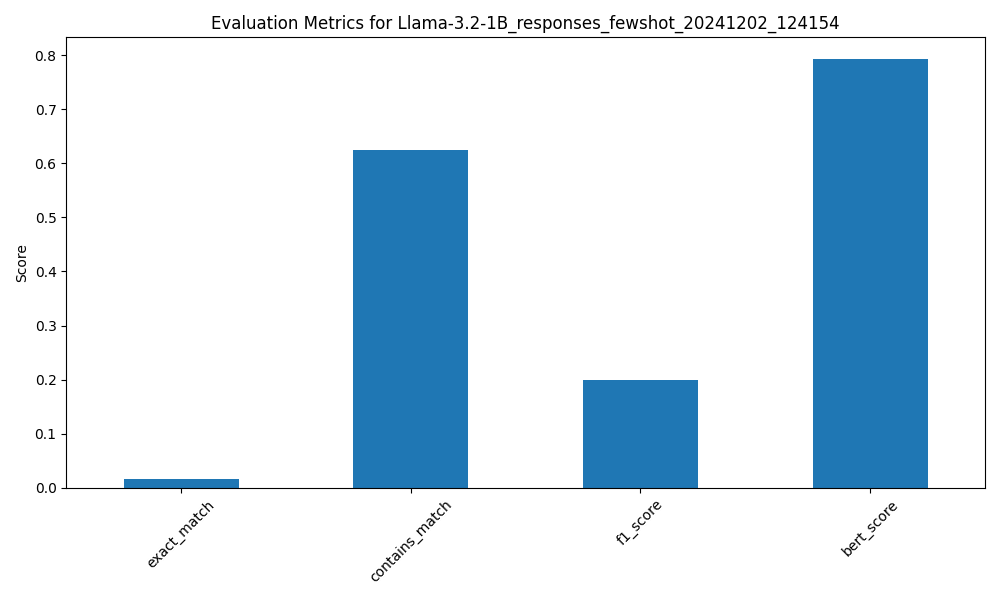
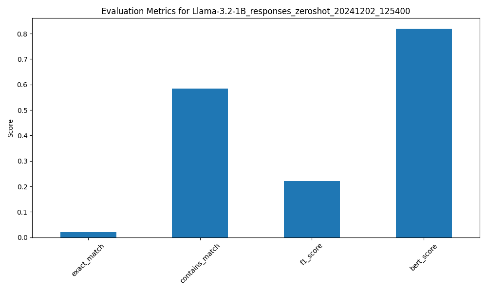

# SLLIM: System Log Local Intelligent Model

**Authors**: Carlos Cruzportillo, Nassos Galiopoulos, Jason Gillette

**Affiliation**: University of Texas at San Antonio  

**Date**: December 2nd, 2024



---
# Introduction

## Problem Statement

The increasing volume of system logs generated by interconnected devices and enterprise systems creates a challenge for IT professionals in efficiently detecting threats and diagnosing issues, necessitating the development of lightweight, intelligent tools for real-time log analysis and query.
<br>
*Do more with less!*

---
# Introduction

## Specific Objectives

1. Fine-tune at least two lightweight LLMs for comparative analysis. :x:
2. Evaluate question answering performance of lightweight LLMs versus resource-intensive models in the cybersecurity domain. :white_check_mark:

---
# Introduction

## Research Questions

1. How well can lightweight LLMs detect system issues and security threats from system logs? :white_check_mark:
2. How effectively can lightweight LLMs perform question answering compared to larger, more resource-intensive models? :white_check_mark:

---
# Methods 

## Models

- **meta-llama/Llama-3.1-8B** as a **Large** Subject
- **meta-llama/Llama-3.2-1B** as a *small* Subject

Access to both models was granted through *Meta AI* via *HuggingFace* :blush:
 
---
# Model 

### Llama-3.1-8B
- Multi-lingual text LLM
- Released July 2024
- 8 billion parameters 
- ~32 GB in size at FP32 *(4 bytes per param)*

---
# Model 

### Llama-3.2-1B
- Multi-lingual text LLM
- Released September 2024
- 1 billion parameters 
- ~4 GB in size at FP32 *(4 bytes per param)*

---
# Methods

## Dataset

- **Source**: LogQA, a question-answering dataset derived from three public log datasets: HDFS, OpenSSH, and Spark.

- **Composition**:
  - **Raw Logs**: 2,000 log entries selected per dataset.
  - **Question Generation**: Utilized a question generation model to create reading comprehension-style questions with answers extracted from the logs.

- **Example**:
  ```json
  {
    "Question": "What is the status of the block blk_-6369730481066968769?",
    "Answer": "terminating",
    "RawLog": "PacketResponder 1 for block blk_-6369730481066968769 terminating"
  }


---

# Methods 

## Evaluation Framework

### 1. **Evaluation Metrics**
- **Exact Match (EM)**: Binary match between the generated answer and ground truth.
- **Contains Match (CM)**: Evaluates if the generated answer contains the ground truth.
- **Token-based F1**: Precision and recall on aligned tokens.
- **BERTScore**: Semantic similarity using embeddings.

---

# Methods 

## Experiment Setup

### Few-Shot vs Zero-Shot
- **Few-Shot Prompting**:
  - Incorporates 2 examples from the training set as context.
  - Example: *"Context: [Log 1] Question: [Q1] Answer: [A1]"*.
- **Zero-Shot Prompting**:
  - Provides no additional examples.
  - Question directly follows the context.

---

# Methods 

## Inference Workflow

1. **Model Loading**:
   - HuggingFace pipelines with `transformers`.
   - Quantized models using `BitsAndBytesConfig` for memory optimization.

2. **Batch Processing**:
   - Test data processed in batches of 2 for GPU efficiency.
   - Token truncation managed dynamically (`max_new_tokens`).

3. **Data Storage**:
   - Results saved as structured JSON for easy evaluation.
   - Includes metadata: context, question, generated answer.

---
## Why GPU efficiency matters



---
## Why GPU efficiency matters



---

# Results

### Aggregated Metrics

| Metric         | Llama-3.1-8B ZS | Llama-3.2-1B ZS | Llama-3.1-8B FS | Llama-3.2-1B FS |
|----------------|-----------------|-----------------|-----------------|-----------------|
| Exact Match    | **0.00**        | **0.02**        | **0.01**        | **0.02**        |
| Contains Match | **0.71**        | **0.58**        | **0.51**        | **0.62**        |
| Token F1       | **0.16**        | **0.22**        | **0.16**        | **0.20**        |
| BERTScore      | **0.83**        | **0.82**        | **0.77**        | **0.79**        |

---
# Results (cont.)

### Observations
- Larger models exhibited only marginally better performance.
- Few-shot prompting degraded performance.
- Tokenization likely skewed matches and underrepresented performance.

---

# Results (cont.)

### Metric Comparison



---

# Results (cont.)

### Metric Comparison



---

# Results (cont.)

### Metric Comparison



---

# Results (cont.)

### Metric Comparison



---

# Discussion

## Key Findings

1. **Model Efficiency**:
   - Llama-3.2-1B successfully handles domain-specific tasks with minimal resources.
   - Llama-3.1-8B demonstrates no significant performance gain.

2. **Few-Shot Effectiveness**:
   - Few-shot prompting introduces noise and complexity, for no performance gain.

3. **Challenges**:
   - Token alignment in noisy log contexts affects EM and F1 scores.
   - BERTScore highlights semantic drift in generated answers.
   - BERTScore does not tell the full story as wrong answers can be semantically similar.

---

# Conclusion

## Contributions

1. A comparative analysis of **lightweight** and **large-scale** LLMs in log-based QA tasks.
2. A novel application of lightweight LLMs on Log analysis tasks. 

## Next Steps

1. Fine-tuning vs. in-context learning.
2. Improving / validating evaluation.
3. Exploring other evaluation metrics for log anomaly detection.
4. Expand scope of log analysis to threat detection.

---

# Questions?
